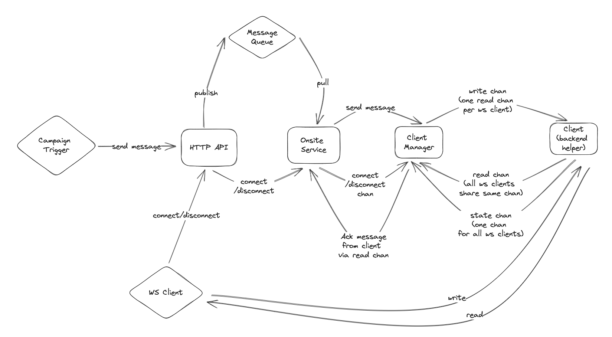

## Overall Architecture



## How to use

Run server in dev mode:

```bash
go run cmd/main.go
```

To use Redis as backend pubsub, you must configure `REDIS_ADDRESS`:

```bash
REDIS_ADDRESS=localhost:6379 go run cmd/main.go
```

By default, server listen on port 11888, you can change this as the following:

```bash
ADDR=0.0.0.0:8080 go run cmd/main.go
```